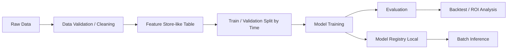

# 競馬予想MLアーキテクチャ（学習用）

## 1. なぜ `takamotoki/jra-horse-racing-dataset` が良いか
- JRAのレース/馬/騎手などの構造化データがまとまっている
- 学習用として「前処理・特徴量設計・時系列評価」を一通り学べる
- まずはこのデータで再現可能なベースラインを作り、後でオッズや外部要因を追加しやすい

## 2. 全体構成

---

## 3. レイヤー設計

### 3.1 Data Layer
**責務**
- 生データの取り込み
- スキーマ統一
- 欠損/外れ値処理
- リーク防止（未来情報を遮断）

**主要コンポーネント**
- `data/ingest.py`: データ取得/配置
- `data/validate.py`: 型・キー・重複チェック
- `data/build_dataset.py`: 学習テーブル生成

**ポイント**
- 主キーの候補: `race_id`, `horse_id`, `date`
- 後処理でオッズを使う場合、締切時点で取得可能だった値のみ利用

### 3.2 Feature Layer
**責務**
- 集約特徴量（直近N走成績、騎手成績、コース適性など）
- カテゴリ処理（競馬場・距離・馬場状態）
- 過去時点で再現できる特徴量のみを採用

**設計指針**
- `features/base_features.py`
- `features/history_features.py`
- `features/encoding.py`

**リーク回避ルール**
- 各サンプル時点 `t` で、`t` 以降の情報を参照しない
- rolling集計は `shift(1)` を原則

### 3.3 Model Layer
段階的に2系統を持つのが学習しやすいです。

1) **Baseline分類**
- 目的変数: `is_win`（1着）または `is_place`（3着以内）
- モデル: LightGBM / XGBoost
- メリット: 実装が簡単で改善サイクルを回しやすい

2) **Rankモデル**
- 1レース内での相対順位を学習
- モデル: LightGBM LambdaRank
- メリット: 競馬の本質（同レース内比較）に自然

### 3.4 Evaluation Layer
**最低限の指標**
- 分類: AUC, LogLoss
- ランキング: NDCG@k, MAP
- 馬券指標: 回収率, 的中率, 破産確率に近い簡易指標

**検証方法（必須）**
- 時系列CV（例: expanding window）
- ランダム分割は使わない

### 3.5 Serving Layer
**目的**
- 当日レースに対して予測スコアをバッチ生成
- 出力: `race_id, horse_id, score, rank, confidence`

**実装**
- `serving/predict_batch.py`
- `scripts/run_predict.py`

### 3.6 Ops Layer
- 設定ファイル: `configs/*.yaml`
- 実験管理: まずはCSVログ/MLflowローカル（任意）
- モデル保存: `artifacts/models/` に日付バージョンで保存

---

## 4. 学習用におすすめの開発ステップ
1. **P0**: Baseline分類を時系列CVで動かす
2. **P1**: 主要特徴量を追加（近走・騎手・距離適性）
3. **P2**: ROIベースの閾値戦略を検証
4. **P3**: Rankモデルへ移行
5. **P4**: 推論バッチを固定化（再現可能なCLI）

---

## 5. 最小MVP仕様
- 入力: 過去レーステーブル（特徴量生成済み）
- 出力: 次レースの推奨順位CSV
- 学習: LightGBM分類 + 時系列CV
- 評価: AUC + 回収率
- 保存: モデルと評価レポートを`artifacts/`へ

---

## 6. よくある失敗
- ランダム分割で高スコア → 本番で崩壊
- ゴール後確定情報（確定人気等）を混入
- 特徴量追加で説明不能になり、改善理由が追えない

---

## 7. 次に追加すると良いもの
- Optunaでハイパーパラメータ探索
- SHAPで特徴量寄与の可視化
- ベッティング戦略最適化（ケリー基準の学習用途実装）
