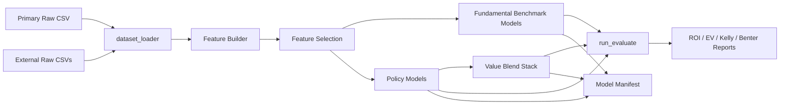

# 現在の競馬予想MLアーキテクチャ

2026-03-09 時点の実装スナップショットです。現行コードに即して、どのデータがどこを通り、どのモデルが何を学習し、ROI 指標がどの買い方を意味するのかを整理します。

## 1. 設計原則
- 本命は LightGBM ではなく CatBoost-first 構成です。高カーディナリティカテゴリ、欠損、表形式の混在特徴を無理なく扱えるためです。
- 「AUC を上げること」ではなく「長期 ROI を壊さず、public odds を補完する追加情報を出せること」を重視します。
- ベンチマーク系と馬券ポリシー系を分離しています。
  - benchmark 系: `odds` / `popularity` を抜いた fundamental model で、`benter_delta_pseudo_r2` を主指標にします。
  - policy 系: `odds` / `popularity` を含めた CatBoost rich model と value stack で、固定額 ROI や Kelly 系を見ます。
- パラメータ調整より、リーク防止・データ拡張・特徴量 contract の正確性を優先します。

## 2. 全体フロー

```mermaid
flowchart LR
  A[Primary Raw CSV] --> B[dataset_loader]
  A2[External Raw CSVs] --> B
  B --> C[Feature Builder]
  C --> D[Feature Selection]
  D --> E1[Fundamental Benchmark Models]
  D --> E2[Policy Models]
  E2 --> F[Value Blend Stack]
  E1 --> G[run_evaluate]
  E2 --> G
  F --> G
  G --> H[ROI / EV / Kelly / Benter Reports]
  E1 --> I[Model Manifest]
  E2 --> I
  F --> I
```

## 3. Data Layer

### 3.1 主テーブルの読み込み
- 実体は [src/racing_ml/data/dataset_loader.py](../src/racing_ml/data/dataset_loader.py) にあります。
- 主表は `data/raw` 配下から自動選択し、列名は alias 正規化で canonical name に寄せます。
- 現在の canonical 列には `race_id`, `horse_id`, `horse_key`, `rank`, `odds`, `track`, `distance`, `jockey_id`, `trainer_id`, `owner_name` などが含まれます。

### 3.2 外部データの統合
- `configs/data.yaml` の `external_raw_dirs`, `append_tables`, `supplemental_tables` で追加ソースを差し込みます。
- loader 側は config-driven で、将来の netkeiba CSV を loader 改修なしで試せる構成です。
- stable な競走馬 ID が必要な外部ソースは `horse_key` を使います。既存主表にはまず `race_id + horse_id` で `horse_key` を戻し、その後 pedigree を `horse_key` で merge します。
- netkeiba crawler の現行 target は `race_result`, `race_card`, `pedigree` です。`race_card` は `race.netkeiba.com` の shutuba page から `horse_key`, 枠番, 馬番, 性齢, 斤量, 騎手, 調教師などの pre-race 列を取ります。owner / breeder は現ページに直出しされないため、profile / pedigree 側で補います。
- 既存の custom supplemental loader:
  - `laptime`
  - `corner_passing_order`

### 3.3 運用上のチェック
- source validation: `scripts/run_validate_data_sources.py`
  - join key 欠損、required columns 欠損、dedupe key 重複をチェックします。
- feature gap: `scripts/run_feature_gap_report.py`
  - raw column の不足と force-include feature の missing / low coverage をチェックします。

### 3.4 現在の外部データ不足
- 現時点で重要なのは以下の pedigree / breeder 系 raw columns です。
  - `breeder_name`
  - `sire_name`
  - `dam_name`
  - `damsire_name`
- ここが埋まらない限り、pedigree 系の条件付き特徴は正しく立ちません。

## 4. Feature Layer

### 4.1 実装位置
- 特徴量生成の本体は [src/racing_ml/features/builder.py](../src/racing_ml/features/builder.py) です。
- 特徴量選択と model input 再現は [src/racing_ml/features/selection.py](../src/racing_ml/features/selection.py) が担当します。

### 4.2 現在の主要特徴群
- 日付派生: `race_year`, `race_month`, `race_dayofweek`
- 枠順・馬番: `gate_ratio`, `frame_ratio`
- pace / corner: `corner_*_ratio`, `corner_gain_2_to_4`, `race_pace_balance_3f`
- course baseline: `course_baseline_*`
- horse 履歴: `horse_last_3_*`, `horse_last_5_*`
- jockey / trainer 履歴: `jockey_last_30_*`, `trainer_last_30_*`
- owner / pedigree 履歴: `owner_last_50_win_rate`, `sire_last_100_*`, `damsire_last_100_*`
- entity-conditioned track-distance 履歴:
  - `horse_track_distance_last_3_avg_rank`
  - `horse_track_distance_last_5_win_rate`
  - `jockey_track_distance_last_50_*`
  - `trainer_track_distance_last_50_*`

### 4.3 リーク防止ルール
- horse 履歴 key は row-wise に解決します。`horse_key` がある行は常に `horse_key` を優先し、不足分だけ `horse_name` または `horse_id` へ fallback します。
- rolling 系は基本的に `shift(1)` 相当の過去のみ集約です。
- race 内に同一 entity が複数出るケースは row-level ではなく race-level rolling を使います。
- `_entity_race_shifted_rolling_mean` は元 frame の index を保持します。これを外すと tail slice で owner / pedigree 履歴が壊れます。
- entity-conditioned key は entity 列が存在するときだけ作ります。
  - 例: `sire_name` が無いのに `sire_track_distance_*` を作ることはしません。

### 4.4 Feature Selection
- 本命系は `selection.mode: all_safe` です。
- 除外対象:
  - ゴール後情報
  - 超高カーディナリティ生文字列
  - 払戻系列
- categorical 列は CatBoost にそのまま渡します。
- train/evaluate artifact には `feature_coverage` を保存し、missing force-include feature を後から追えるようにしています。

## 5. Model Layer

### 5.1 Fundamental Benchmark Plane
用途: public odds を抜いた状態で「市場を補完できるか」を測る面です。

- 主な config:
  - `configs/model_catboost_fundamental.yaml`
  - `configs/model_catboost_fundamental_enriched.yaml`
  - `configs/features_catboost_fundamental.yaml`
  - `configs/features_catboost_fundamental_enriched.yaml`
- 特徴:
  - `odds` / `popularity` を使わない
  - 主指標は `benter_delta_pseudo_r2`
  - raw ROI が一時的に良くても `ΔR² <= 0` なら採用しません

### 5.2 Policy / ROI Plane
用途: 実際の買い目候補を出す面です。

- rich win model
  - config: `configs/model_catboost.yaml`
  - `odds` / `popularity` を含む CatBoost win probability model
- time / time deviation model
  - config: `configs/model_catboost_time.yaml`
  - config: `configs/model_catboost_time_deviation.yaml`
  - 予測タイムやコース基準からの偏差を学習し、順位付けに使います
- alpha / ROI model
  - config: `configs/model_catboost_alpha.yaml`
  - config: `configs/model_catboost_roi.yaml`
  - 現在の mainline では二次的です

### 5.3 現在の本命 ROI stack
- 主 stack は `win + time_deviation` の 2 コンポーネントです。
- value blend bundle は [src/racing_ml/models/value_blend.py](../src/racing_ml/models/value_blend.py) で構築します。
- 現在の主 config:
  - CPU: `configs/model_catboost_value_stack_time.yaml`
  - GPU: `configs/model_catboost_value_stack_time_gpu.yaml`
- 合成ロジック:
  - base は win probability の logit
  - time_deviation の低い値を `tanh` で signal 化して加算
  - `market_blend_weight` で odds 由来の market probability に寄せる

### 5.4 GPU Path
- CatBoost GPU は利用可能です。今回 RTX 4060 上で full retrain を実施済みです。
- GPU 用 config:
  - [configs/model_catboost_gpu.yaml](../configs/model_catboost_gpu.yaml)
  - [configs/model_catboost_time_deviation_gpu.yaml](../configs/model_catboost_time_deviation_gpu.yaml)
  - [configs/model_catboost_value_stack_time_gpu.yaml](../configs/model_catboost_value_stack_time_gpu.yaml)
- 注意:
  - CatBoost GPU は classification / regression で `rsm` 非対応です。
  - CPU config をそのまま GPU に流すと validation で落ちます。

## 6. Training Layer

### 6.1 train orchestration
- 実体は [src/racing_ml/pipeline/train_pipeline.py](../src/racing_ml/pipeline/train_pipeline.py) です。
- 処理順:
  1. config load
  2. training table load
  3. feature build
  4. feature selection / feature coverage summary
  5. leakage audit
  6. train / valid split
  7. task ごとの fit
  8. report / manifest 書き出し

### 6.2 progress visibility
- 重い区間には `ProgressBar` と `Heartbeat` を入れています。
- データロード、feature build、fit、walk-forward は long-running でも停止に見えないようになっています。

## 7. Evaluation Layer

### 7.1 実装位置
- 評価本体は [scripts/run_evaluate.py](../scripts/run_evaluate.py) です。
- score の共通生成は [src/racing_ml/evaluation/scoring.py](../src/racing_ml/evaluation/scoring.py) が担当します。
- ROI policy simulation は [src/racing_ml/evaluation/policy.py](../src/racing_ml/evaluation/policy.py) が担当します。

### 7.2 指標の意味
このプロジェクトの ROI 指標は、すべて「単勝の固定額シミュレーション」か「Kelly シミュレーション」です。

- `top1_roi`
  - 各レースで model score が最大の 1 頭だけを買う
  - 1 ベット 100 円固定
- `ev_top1_roi`
  - 各レースで `expected_value = score × odds` が最大の 1 頭だけを買う
  - 1 ベット 100 円固定
- `ev_threshold_1_0_roi`
  - `score × odds >= 1.0` の馬だけ買う
  - 1 ベット 100 円固定
- `ev_threshold_1_2_roi`
  - `score × odds >= 1.2` の馬だけ買う
  - 1 ベット 100 円固定
- `linear_blend_kelly_*`
  - isotonic calibration 後の model probability を market probability と線形 blend した確率で、fractional Kelly を回す
- `benter_ev_top1_roi`
  - Benter の second-stage で `model_prob` と `market_prob` を再合成した確率を使い、`expected_value` 最大の 1 頭を買う
- `benter_kelly_*`
  - Benter 再合成確率を使った fractional Kelly

### 7.3 benchmark と policy の違い
- `top1_roi` や `ev_top1_roi` は「実際にどう買うか」の proxy です。
- `public_pseudo_r2`, `model_pseudo_r2`, `benter_delta_pseudo_r2` は「市場をどれだけ補完したか」の benchmark です。
- policy 指標が良くても benchmark が悪い場合、単なる market 追随や過学習の可能性があります。

## 8. Artifacts
- train artifact
  - model: `artifacts/models/*.joblib`
  - report: `artifacts/reports/train_metrics*.json`
  - manifest: `artifacts/models/*.manifest.json`
- evaluation artifact
  - summary: `artifacts/reports/evaluation_summary*.json`
  - by-date: `artifacts/reports/evaluation_by_date*.csv`
- stack artifact
  - `kind: value_blend_model`
  - component metadata と blend params を同梱します

## 9. 現在の主結果

### 9.1 GPU で学習した ROI mainline
- config: `configs/model_catboost_value_stack_time_gpu.yaml`
- components:
  - `configs/model_catboost_gpu.yaml`
  - `configs/model_catboost_time_deviation_gpu.yaml`
- 100k rows 評価:
  - `top1_roi = 0.802865`
  - `ev_top1_roi = 0.860271`
  - `ev_threshold_1_0_roi = 0.839528`
  - `ev_threshold_1_2_roi = 0.701514`
  - `auc = 0.832061`
  - `logloss = 0.207528`
  - `model_pseudo_r2 = 0.237940`
  - `benter_delta_pseudo_r2 = -0.009343`

### 9.2 この結果が意味する買い方
- `top1_roi = 0.802865`
  - 毎レース、stack score が最上位の 1 頭を単勝で 100 円買った結果です。
- `ev_top1_roi = 0.860271`
  - 毎レース、`score × odds` が最大の 1 頭を単勝 100 円で買った結果です。
- `ev_threshold_1_0_roi = 0.839528`
  - `score × odds >= 1.0` を満たす馬だけ単勝 100 円で買った結果です。
- `benter_ev_top1_roi = 1.002293`
  - calibration split 上で Benter 再合成した確率を使い、`expected_value` 最大の 1 頭を買った結果です。
  - ただし同じ run で `benter_delta_pseudo_r2 = -0.009343` なので、benchmark 観点では改善扱いにしません。

## 10. 現在のボトルネック
- tuning ではなく raw signal が不足しています。
- 特に pedigree / breeder raw が欠けているため、fundamental benchmark が public を補完しきれていません。
- current-data-only の pace / corner / track-distance 追加は、独立 signal を多少増やしても決定打にはなっていません。

## 11. 次の優先課題
1. pedigree / breeder 外部 CSV を onboarding する
2. validation と feature gap を再実行する
3. fundamental benchmark を再学習し `benter_delta_pseudo_r2` を再確認する
4. benchmark が改善したら、その component を policy stack に戻して ROI を再検証する

## 12. 関連ドキュメント
- ROI 基礎設計: [roi_foundation_design.md](roi_foundation_design.md)
- 長期運用設計: [architecture_long_term.md](architecture_long_term.md)
- artifact 運用: [model_artifacts.md](model_artifacts.md)
- benchmark 解釈: [external_benchmark_targets.md](external_benchmark_targets.md)
- 外部データ拡張: [netkeiba_dataset_extension.md](netkeiba_dataset_extension.md)
