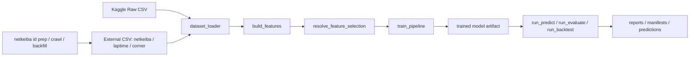

# 現在のアーキテクチャ構成

2026-03-11 時点の実装スナップショットです。現行コードと最新 artifact に合わせて、データ取得から特徴量生成、学習、評価、外部データ拡張、運用上のボトルネックまでを整理します。

## 1. 現在の設計方針

- 現在の本命は LightGBM ではなく CatBoost-first 構成です。
  - LightGBM は baseline と比較対象として維持します。
  - CatBoost は高カーディナリティカテゴリ、欠損、数値とカテゴリの混在、履歴特徴との相性を見込んだ主力です。
- 評価は精度だけでなく ROI を主眼に置きます。
  - AUC / logloss は見ますが、それだけで採用しません。
  - fixed-stake ROI、EV ベース ROI、Benter 系 benchmark を並べて判定します。
- データ拡張は主表破壊型ではなく multi-source merge で行います。
  - Kaggle 主表を残しつつ、netkeiba 由来の race result / race card / pedigree を外部 CSV として追加します。
- リーク防止を強く優先します。
  - 時系列 split、shift 済み rolling、leakage audit、post-race 列の feature 選別を標準フローに入れています。

## 2. 全体フロー


```mermaid
flowchart LR
  A[Kaggle Raw CSV] --> B[dataset_loader]
  A2[External CSV: netkeiba / laptime / corner] --> B
  B --> C[build_features]
  C --> D[resolve_feature_selection]
  D --> E[train_pipeline]
  E --> F[trained model artifact]
  F --> G[run_predict / run_evaluate / run_backtest]
  H[netkeiba id prep / crawl / backfill] --> A2
  G --> I[reports / manifests / predictions]
```

## 3. レイヤ別の実装

### 3.1 Data Layer

主な実装:

- `scripts/run_ingest.py`
- `src/racing_ml/data/ingest.py`
- `src/racing_ml/data/dataset_loader.py`
- `configs/data.yaml`

責務:

- KaggleHub の `takamotoki/jra-horse-racing-dataset` を主表として用意します。
- `configs/data.yaml` の `supplemental_tables` / `append_tables` に従い、追加 CSV を merge します。
- 列名は alias 正規化で canonical 列へ寄せます。
- 現在の canonical 列には以下が含まれます。
  - `date`, `race_id`, `horse_id`, `horse_key`, `horse_name`
  - `rank`, `odds`, `popularity`
  - `track`, `distance`, `weather`, `ground_condition`
  - `jockey_id`, `trainer_id`, `owner_name`, `breeder_name`
  - `sire_name`, `dam_name`, `damsire_name`
  - `finish_time`, `closing_time_3f`, `corner_*_position`

現行の `configs/data.yaml` では次を取り込み対象にしています。

- append:
  - `netkeiba_race_result`
- supplemental:
  - `laptime`
  - `corner_passing_order`
  - `netkeiba_race_result_keys`
  - `netkeiba_race_card`
  - `netkeiba_pedigree`

マージ方針:

- row append は `append_tables`
- 列補完は `supplemental_tables`
- `merge_mode` により `fill_missing` / `prefer_supplemental` を選びます

ID の扱い:

- 外部 pedigree 系は `horse_id` ではなく `horse_key` を基準にします。
- `race_result` / `race_card` で `horse_key` を補完してから `pedigree` を結合する設計です。

### 3.2 Feature Layer

主な実装:

- `src/racing_ml/features/builder.py`
- `src/racing_ml/features/selection.py`
- `configs/features.yaml`
- `configs/features_catboost_rich.yaml`
- `configs/features_catboost_fundamental.yaml`
- `configs/features_catboost_fundamental_enriched.yaml`

`builder.py` の責務:

- 基本派生:
  - `race_year`, `race_month`, `race_dayofweek`
  - `field_size`, `gate_ratio`, `frame_ratio`
- pace / corner 派生:
  - `corner_2_ratio`, `corner_4_ratio`, `corner_gain_2_to_4`
  - `race_pace_balance_3f`
- time 系派生:
  - `time_per_1000m`, `time_margin_sec`, `time_deviation`
- 履歴特徴:
  - horse: `horse_last_3_*`, `horse_last_5_*`
  - jockey / trainer: `*_last_30_*`
  - owner / breeder / sire / damsire: `*_last_50_*`, `*_last_100_*`
  - track-distance 条件付き履歴: `horse_track_distance_*`, `jockey_track_distance_*`, `trainer_track_distance_*`, `sire_track_distance_*`

現在の重要な仕様:

- horse 履歴 key は `horse_key` を最優先し、不足時のみ `horse_name` / `horse_id` に fallback します。
- rolling は `shift(1)` 済みの過去だけを使います。
- `corner_2_position` が欠けるレースでは earliest available pre-stretch corner に fallback します。
- lineage 系や entity-conditioned key は、必要な entity 列が存在する場合だけ作ります。

`selection.py` の責務:

- `explicit` と `all_safe` の 2 モードで model input を解決します。
- post-race 列、払戻列、結果そのもの、内部 key を feature から除外します。
- CatBoost 向けに categorical columns を自動判定します。
- `summarize_feature_coverage(...)` で force-include 特徴の missing / low coverage を記録します。

### 3.3 Model Layer

主な実装:

- `src/racing_ml/models/trainer.py`
- `src/racing_ml/models/value_blend.py`
- `configs/model*.yaml`

`trainer.py` の責務:

- LightGBM / CatBoost の初期化
- GPU runtime validation
- time split
- fit / valid 評価
- joblib artifact 出力

サポートしている主な task:

- `classification`
- `ranking`
- `roi_regression`
- `market_deviation`
- `time_regression`
- `time_deviation`

現在のモデル面の整理:

- baseline:
  - `configs/model.yaml`
  - LightGBM classification
- CatBoost win:
  - `configs/model_catboost.yaml`
- CatBoost fundamental benchmark:
  - `configs/model_catboost_fundamental.yaml`
  - `configs/model_catboost_fundamental_enriched.yaml`
- CatBoost Top3 / ranking / ROI / alpha:
  - `configs/model_catboost_top3.yaml`
  - `configs/model_catboost_ranker.yaml`
  - `configs/model_catboost_roi.yaml`
  - `configs/model_catboost_alpha.yaml`
- time 系:
  - `configs/model_catboost_time.yaml`
  - `configs/model_catboost_time_deviation.yaml`
- stack:
  - `configs/model_catboost_value_stack.yaml`
  - `configs/model_catboost_value_stack_time.yaml`
  - GPU 用 `*_gpu.yaml`

value blend:

- `value_blend_model` は meta learner ではなく component bundle です。
- `win` を土台に、必要に応じて `alpha` / `roi` / `time` を logit 上で加算します。
- `market_blend_weight` で市場確率へ寄せる設定を持ちます。

### 3.4 Training Layer

主な実装:

- `scripts/run_train.py`
- `src/racing_ml/pipeline/train_pipeline.py`

実行順:

1. config load
2. training table load
3. feature build
4. feature selection / coverage summary
5. leakage audit
6. train / valid split
7. model fit
8. report / manifest 書き出し

時系列 split は現在 `configs/data.yaml` で以下です。

- train end: `2019-12-31`
- valid start: `2020-01-01`
- valid end: `2021-07-31`

長時間処理では `ProgressBar` と `Heartbeat` を使い、停止に見えないようにしています。

### 3.5 Evaluation Layer

主な実装:

- `scripts/run_evaluate.py`
- `src/racing_ml/evaluation/scoring.py`
- `src/racing_ml/evaluation/policy.py`
- `src/racing_ml/evaluation/benchmark.py`
- `src/racing_ml/evaluation/walk_forward.py`
- `src/racing_ml/evaluation/leakage.py`

評価の 2 面:

- ROI / 実運用 proxy
  - `top1_roi`
  - `ev_top1_roi`
  - `ev_threshold_1_0_roi`
  - `ev_threshold_1_2_roi`
  - Kelly / portfolio / walk-forward 指標
- benchmark / 市場補完力
  - `public_pseudo_r2`
  - `model_pseudo_r2`
  - `benter_combined_pseudo_r2`
  - `benter_delta_pseudo_r2`

現在の ROI 指標の意味:

- `top1_roi`
  - 各レースで score 最大の 1 頭を単勝固定額で買う
- `ev_top1_roi`
  - 各レースで `score × odds` 最大の 1 頭を単勝固定額で買う
- `ev_threshold_*`
  - EV 閾値を超えるときだけ買う

採用方針:

- AUC が少し高いだけでは採用しません。
- ROI と benchmark の両面で悪化していないことを見ます。

### 3.6 Serving / Backtest / Dashboard Layer

主な実装:

- `scripts/run_predict.py`
- `src/racing_ml/serving/predict_batch.py`
- `scripts/run_backtest.py`
- `src/racing_ml/pipeline/backtest_pipeline.py`
- `scripts/run_dashboard.py`

役割:

- `run_predict.py`
  - 指定日または最新日について予測 CSV / PNG を出力
- `run_backtest.py`
  - prediction CSV をもとに hit rate / simple ROI / EV ROI を算出
- `run_dashboard.py`
  - ダッシュボード用 JSON / CSV / PNG を生成

### 3.7 Artifact Layer

主な実装:

- `src/racing_ml/common/artifacts.py`
- `scripts/run_bundle_models.py`
- `scripts/run_build_value_stack.py`
- `src/racing_ml/pipeline/bundle_pipeline.py`

標準 artifact:

- model: `artifacts/models/*.joblib`
- report: `artifacts/reports/*.json`
- manifest: `artifacts/models/*.manifest.json`
- evaluation latest:
  - `artifacts/reports/evaluation_summary.json`
  - `artifacts/reports/evaluation_by_date.csv`
- evaluation versioned:
  - `artifacts/reports/evaluation_summary_<model>.json`
  - `artifacts/reports/evaluation_by_date_<model>.csv`

現在の model artifact は bare estimator ではなく dict bundle の場合があります。典型的には以下を持ちます。

- `kind`
- `task`
- `feature_columns`
- `categorical_columns`
- `model`
- `prep`

## 4. netkeiba 拡張ライン

主な実装:

- `scripts/run_prepare_netkeiba_ids.py`
- `src/racing_ml/data/netkeiba_id_prep.py`
- `scripts/run_collect_netkeiba.py`
- `src/racing_ml/data/netkeiba_crawler.py`
- `scripts/run_backfill_netkeiba.py`
- `src/racing_ml/data/netkeiba_backfill.py`
- `scripts/run_netkeiba_benchmark_gate.py`
- `scripts/run_netkeiba_wait_then_cycle.py`

流れ:

1. training table から race_id / horse_key 候補を抽出
2. `race_result` / `race_card` / `pedigree` を crawl
3. canonical CSV と raw HTML を保存
4. coverage snapshot を生成
5. readiness が満たされると train/evaluate を自動実行

運用上の特徴:

- lock file で同時 crawl を防止します
- manifest で途中状態と stale 状態を追跡します
- `wait_then_cycle` で既存バッチ完了待ち後に 1 cycle + benchmark gate を自動接続できます

現在の target:

- `race_result`
- `race_card`
- `pedigree`

## 5. 現在の主力構成

2026-03-11 時点で最新の mainline benchmark は次です。

- model config:
  - `configs/model_catboost_fundamental_enriched.yaml`
- feature config:
  - `configs/features_catboost_fundamental_enriched.yaml`
- artifact manifest:
  - `artifacts/models/catboost_fundamental_enriched_win_model.manifest.json`
- latest summary:
  - `artifacts/reports/evaluation_summary.json`

この構成の特徴:

- CatBoost classification
- `all_safe` feature selection
- 91 features
- categorical 36 列
- lineage 系を force-include している

最新 summary の主要値:

- `top1_roi = 0.77148`
- `ev_top1_roi = 0.42636`
- `auc = 0.75738`
- `logloss = 0.22860`
- `model_pseudo_r2 = 0.11228`
- `benter_delta_pseudo_r2 = -0.001019`

## 6. 直近の外部データ拡張結果

2017 年ウィンドウの safe wait-then-cycle 後の主要状態:

- handoff manifest:
  - `artifacts/reports/netkeiba_backfill_handoff_manifest.json`
- coverage snapshot:
  - `artifacts/reports/netkeiba_coverage_snapshot.json`

反映内容:

- `race_result`: 100/100, rows 23512
- `race_card`: 100/100, rows 23512
- `pedigree`: 500/500, rows 6855, unique horse_key 6355

coverage snapshot:

- latest tail の `breeder_name` / `sire_name` / `dam_name` / `damsire_name` non-null ratio = `0.902`
- paired race subset では同 ratio = `0.736047`

## 7. 現在のボトルネック

直近の検証で重要だった点は、coverage 改善と ROI 改善が一致していないことです。

### 7.1 いま起きていること

- 2017 まで遡る backfill で lineage raw coverage は大きく改善しました。
- しかし mainline enriched benchmark の ROI は悪化しました。
- mainline artifact では以下が low-coverage force-include として残っています。
  - `breeder_last_50_win_rate`
  - `sire_last_100_win_rate`
  - `sire_last_100_avg_rank`
  - `damsire_last_100_win_rate`
  - `sire_track_distance_last_80_win_rate`

### 7.2 診断結果

診断用 no-lineage ablation では以下を除外しました。

- `breeder_last_50_win_rate`
- `sire_last_100_win_rate`
- `sire_last_100_avg_rank`
- `damsire_last_100_win_rate`
- `sire_track_distance_last_80_win_rate`

結果:

- no-lineage summary:
  - `artifacts/reports/evaluation_summary_catboost_fundamental_enriched_no_lineage_win.json`
- 改善した値:
  - `top1_roi = 0.78123`
  - `ev_top1_roi = 0.45969`
  - `benter_delta_pseudo_r2 = -0.000326`
- 悪化した値:
  - `auc = 0.75708`
  - `logloss = 0.22864`
  - `model_pseudo_r2 = 0.10016`

解釈:

- 現在の lineage 特徴は ranking / calibration には少し寄与しても、単勝 ROI には逆風になっている可能性が高いです。
- したがって次の打ち手は「さらに古い年を盲目的に backfill」ではなく、lineage の利用条件見直しです。

## 8. 現在の優先課題

1. lineage 特徴の coverage-based gating か一時除外を repo 側の設定として固定化する
2. 古い年より先に、新しい年の欠損や最新側の不足を優先して埋める
3. benchmark と policy の両面で再評価し、ROI>1 に近づく構成を選別する
4. no-lineage が再現良好なら mainline config を置き換える、または派生 config を正式化する

## 9. よく使う実行入口

```bash
python scripts/run_ingest.py --config configs/data.yaml
python scripts/run_train.py --config configs/model_catboost_fundamental_enriched.yaml --data-config configs/data.yaml --feature-config configs/features_catboost_fundamental_enriched.yaml
python scripts/run_evaluate.py --config configs/model_catboost_fundamental_enriched.yaml --data-config configs/data.yaml --feature-config configs/features_catboost_fundamental_enriched.yaml --max-rows 200000 --wf-mode off
python scripts/run_predict.py --config configs/model_catboost.yaml --data-config configs/data.yaml --feature-config configs/features_catboost_rich.yaml --race-date 2021-07-31
python scripts/run_backfill_netkeiba.py --data-config configs/data.yaml --crawl-config configs/crawl_netkeiba_template.yaml --date-order desc --race-batch-size 100 --pedigree-batch-size 500
```

## 10. 要点まとめ

- repo は現在、multi-source tabular ML pipeline として成立しています。
- baseline は LightGBM ですが、本命運用面は CatBoost-first です。
- ROI は単なる精度の副産物ではなく、評価フローに明示的に組み込まれています。
- 最大の技術課題は「lineage coverage を増やすこと」そのものではなく、「lineage を ROI に効く形で使えるか」です。
- 次の改善余地は blind backfill より、特徴量利用条件と最新側データ補完の最適化にあります。