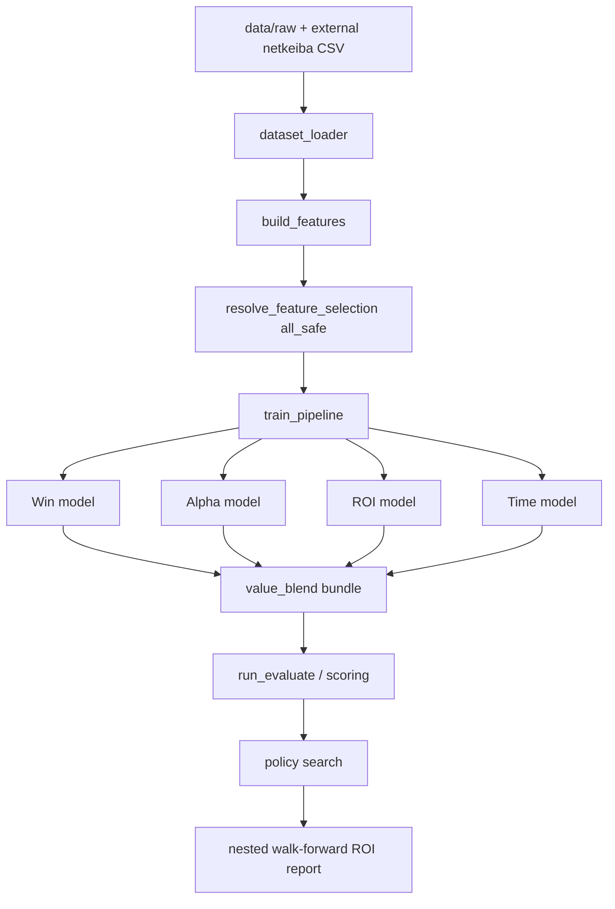

# 現在のモデルアーキテクチャ、ボトルネック、実行計画

最終更新: 2026-03-19

## 1. 目的
- 現在の実装を、データ取得から特徴量生成、学習、価値スタック、評価、運用制約まで一枚で把握できる状態にする。
- 直近の 2024 YTD nested walk-forward 結果を基準に、どこが ROI の主ボトルネックかを明示する。
- 次の実験を「文書化だけ」で止めず、すぐ実行できる config と手順まで落とす。

## 2. 現在のアーキテクチャ

### 2.1 Data layer
- 主表は `data/raw` 配下の Kaggle/JRA CSV で、追加情報は netkeiba append と supplemental table で補完する。
- 現在の recent-domain 改修により、2024 YTD 評価窓でも race class、surface、斤量、horse_key ベース再同定がかなり復旧している。
- pedigree / lineage は recent 帯で coverage が薄く、列は存在しても有効サンプルが足りない。

### 2.2 Feature layer
- `build_features` は shift 済み rolling を前提とした履歴特徴、pace 系、time 系、recent-domain 系を生成する。
- horse 履歴キーは `horse_key` を最優先し、不足時だけ `horse_name` / `horse_id` に fallback する。
- time 系は `time_per_1000m` を基準に `course_baseline_time_per_1000m` と `time_deviation` を作る。
- ただし course baseline key はまだ粗く、コース向きや内外の情報までは十分吸収していない。

### 2.3 Model layer
- 単体モデルは CatBoost と LightGBM の両方を持つが、主力の勝率推定は CatBoost が中心。
- 現在の stack は meta learner ではなく `value_blend_model` の component bundle で、`win` を土台に `alpha` / `roi` / `time` を logit 加算する。
- 市場確率は `market_blend_weight` で混ぜるため、予測は常に public market と強く結びつく。

### 2.4 Evaluation layer
- 採用判定は raw AUC/logloss だけでなく、`top1_roi`、`ev_top1_roi`、Benter 系、nested walk-forward の weighted ROI と bets を見る。
- 現在の運用制約は `gate_then_roi` で、`min_bet_ratio=0.05`、`min_bets_abs=100`、`max_drawdown=0.40`、`min_final_bankroll=0.90` が主な gate になっている。
- feasible candidate が無い fold は `no_bet` として記録されるため、raw 指標と operational 指標が分離される。

## 3. 現在の主な候補

### 3.1 Public-free baseline
- no-lineage CatBoost は recent 2024 YTD nested WF で `wf_weighted_roi=0.5788`, `wf_bets_total=603`。
- 流動性は高いが、ROI が低く deployable ではない。

### 3.2 Parser-fix 後の旧 stack baseline
- CatBoost value stack は parser/canonical repair 後に `wf_weighted_roi=0.7672`, `wf_bets_total=329` まで回復した。
- 2/5 folds が kelly、3/5 folds が no_bet で、完全 no-bet 状態からは脱却した。

### 3.3 現在の post-retrain 最良候補
- `configs/model_catboost_value_stack_lgbm_roi_tuned_top1.yaml` の hybrid は `CatBoost win + LightGBM ROI` を採用し、recent 2024 YTD nested WF で `wf_weighted_roi=0.7710`, `wf_bets_total=232`。
- weighted ROI は最良だが、bets は parser-fix 後 baseline の 329 から 232 に減っている。
- したがって現時点では「最良 ROI 候補」ではあるが、「即 mainline 交代」とまでは言い切れない。

### 3.4 現在の budget-matched 最良候補
- high-coverage subset diagnostic (`103 features`) で `CatBoost win + LightGBM ROI` を再学習し、diagnostic 用に narrowed policy search を掛けた recent 2024 YTD nested WF は、portfolio bankroll 正規化の修正後に再評価すると raw `top1_roi=0.7941`, `ev_top1_roi=0.4303`, `auc=0.8423`, `wf_weighted_roi=0.8148`, `wf_bets_total=407` だった。
- 同じ corrected policy 下で `roi_weight=0.12` へ上げた subset alternative は `wf_weighted_roi=0.8152`, `wf_bets_total=409` で、ごく僅差だが現行 best になった。
- さらに同じ `roi_weight=0.12` subset に対して、policy search だけを狭く緩めた `configs/model_catboost_value_stack_lgbm_roi_high_coverage_tune_roi012_liquidity.yaml` を 2026-03-15 に評価すると、nested WF は `wf_weighted_roi=0.9346`, `wf_bets_total=700` まで改善した。fold 4-5 も `portfolio` で通り、fold 構成は `portfolio, kelly, kelly, portfolio, portfolio` になった。
- 同じ 32-trial diagnostic budget で旧 `top1-tuned` 117-feature hybrid を再評価しても、依然として 5/5 folds が `no_bet` で `wf_weighted_roi=null`, `wf_bets_total=0` のままだった。したがって corrected 後も、low-coverage lineage / sparse pace-fit を外した subset 化が policy feasibility を回復させているという結論は維持される。

## 4. ボトルネック分析

### 4.1 低 coverage 特徴が rich retrain を壊している
- `summarize_feature_coverage` は missing と low coverage force-include を manifest/report に残している。
- recent 帯では lineage 系が依然 low coverage で、117-feature を全 component に一括伝播させると stack の nested WF が `0.7672 -> 0.4671` まで悪化した。
- 問題は feature 数そのものより、coverage の不均一な特徴を同じ重みで component に流し込んでいる点にある。
- high-coverage subset で force-include の low coverage をゼロにしたところ、同じ narrowed policy budget と corrected policy gating 下で旧 117-feature hybrid は `all no_bet` のまま、subset hybrid は `0.8148 / 407 bets`、`roi_weight=0.12` 版では `0.8152 / 409 bets` になった。したがってこの仮説は現時点で最も強く支持されている。

### 4.2 Alpha component が不安定
- same-window tuning では best raw candidate が `alpha_weight=0` だった。
- CatBoost ROI-only diagnostic は full retrain より改善したため、現時点の alpha は additive edge ではなくノイズ源になっている可能性が高い。
- ただし「alpha という概念が不要」ではなく、「CatBoost alpha の現行実装が不安定」がより正確な診断である。

### 4.3 市場アンカーが強く、独自情報が薄い
- stack は市場確率と高相関で、public を上回る独自情報の増分がまだ小さい。
- そのため raw 指標が良くても nested policy で打てる候補が減り、`no_bet` に落ちやすい。
- これは model edge より calibration / market anchoring / policy feasibility の問題が大きいことを示す。

### 4.4 ROI 最適化と operational 最適化がずれる
- hybrid tuning でも raw EV-optimal は `ev_top1_roi` で勝ったが、nested WF weighted ROI では top1-optimal に負けた。
- つまり現在の main bottleneck は「同期間 raw 指標を上げること」ではなく、「nested policy で通る形の edge に変換すること」である。
- さらに今回、diagnostic search budget を 720 trial から 32 trial に絞っても、corrected policy 下で subset hybrid は `0.815` 前後の運用成績を維持し、旧 117-feature hybrid は `all no_bet` のままだった。その後、同じ subset モデルのまま `min_prob` / `min_edge` / `min_expected_value` をわずかに緩めた narrow liquidity search を掛けると `0.9346 / 700 bets` まで伸びたため、bottleneck は純粋な feature/model 弱さだけでなく、policy threshold の置き方にも強く依存していたことが分かった。

### 4.5 Time 正規化は部分的で、コース粒度がまだ粗い
- `time_per_1000m` と course baseline で最低限の正規化はできている。
- しかし向き、直線、内外、surface detail を十分に反映した baseline ではないため、pace/time 系のシグナルはまだ粗い。
- これは time component を mainline に戻せていない一因でもある。

## 5. 実行計画

### Track A: 混成 alpha の再診断
- 目的: CatBoost alpha ではなく LightGBM alpha を小さく混ぜたときに、ROI を落とさず bets を戻せるか確認する。
- 仮説: alpha 自体が不要なのではなく、現行 CatBoost alpha が heavy すぎるか calibration が悪い。
- 即時アクション:
  - `model_lightgbm_alpha_cpu_diag.yaml` を追加
  - `CatBoost win + LightGBM alpha + LightGBM ROI` stack を追加
  - same 2024 YTD nested WF で baseline 比較
- 2026-03-14 実行結果:
  - small alpha probe (`alpha_weight=0.05`) は `wf_weighted_roi=0.6764`, `wf_bets_total=144`。
  - 現 top1-tuned hybrid (`0.7710 / 232 bets`) と parser-fix 後 baseline (`0.7672 / 329 bets`) の両方を下回った。
  - 結論として、alpha track は当面の主戦場から外し、feature subset 側を優先する。

### Track B: high-coverage feature gate
- 目的: rich 117-feature をそのまま全 component に流すのをやめ、coverage の高い subset を stack component ごとに切り分ける。
- 仮説: low coverage lineage / sparse recent features が calibration drift を起こしている。
- 実装候補:
  - feature coverage threshold に基づく explicit subset config
  - alpha/roi component だけ lineage と sparse pace-fit を外す ablation
- 2026-03-14 時点の結論:
  - この track は keep。
  - 103-feature subset は同条件比較で最も有望な線になった。

### Track C: liquidity 改善
- 目的: top1-tuned hybrid の `232 bets` を baseline の `329 bets` に近づける。
- 仮説: model edge 自体より、market blend と policy gate の相互作用が bets を削っている。
- 実装候補:
  - inner search の blend range を `0.97` 近傍で再分解
  - policy gate 緩和ではなく、feasible fold を増やす score shaping を優先
- 最新の subset hybrid は corrected policy 下で `407 bets` まで戻っており、そのうえで subset 固定のまま model-level `market_blend_weight` と `roi_weight` を狭い範囲で詰め直した。
- corrected policy 下での 2026-03-15 local tuning では、`roi_weight=0.12` 単独変更が `wf_weighted_roi=0.8152`, `wf_bets_total=409` で最良、元設定は `0.8148 / 407 bets`、`market_blend_weight=0.965` 単独や同時変更は再評価優先度を下げてよい水準だった。
- さらに `src/racing_ml/evaluation/policy.py` の portfolio bankroll 正規化を修正したことで、fold 1 (`valid=2024-04-20..2024-05-19`) の high-ROI portfolio が `max_drawdown` ではなく正常に feasible 判定されるようになった。fix 後の `scripts/run_wf_feasibility_diag.py` では fold 1 に `portfolio` feasible が 4 候補残り、fold 4 (`valid=2024-07-06..2024-08-04`) と fold 5 (`valid=2024-08-03..2024-09-01`) だけが 32/32 `min_bets` failure になった。
- その次に、同じ subset モデルに対して `min_probabilities=[0.03, 0.05]`, `min_edges=[0.0, 0.01]`, `min_expected_values=[0.95, 1.0]`, `odds_max=25` の narrow liquidity search を 1 本だけ試したところ、fold 4 は valid `152 bets` / test `180 bets` / test ROI `1.1972`、fold 5 は valid `141 bets` / test `95 bets` / test ROI `0.9147` でどちらも `portfolio` に切り替わった。weighted ROI は `0.9346`, 総 bets は `700` まで改善した。
- したがって late-summer 帯の `no_bet` は純粋な score density 不足だけではなく、policy threshold の置き方にも原因があった。現時点の残課題は fold 4-5 の abstain ではなく、fold 1 test ROI が `0.5351` と弱いこと、そして全体 weighted ROI がまだ `1.0` を下回ることである。

## 6. 今回の着手内容
- この文書作成と同時に、Track A 用の LightGBM alpha CPU diagnostic config と hybrid alpha+roi stack config を追加する。
- alpha 診断は同日中に実行し、small alpha probe が悪化することを確認した。
- 次にすぐ入れるよう、Track B 用の high-coverage subset diagnostic config 群も追加する。
- Track B は完了し、subset 固定の local tuning まで実施した。
- さらに 2026-03-15 に narrow liquidity config (`model_catboost_value_stack_lgbm_roi_high_coverage_tune_roi012_liquidity.yaml`) と補助 probe script (`scripts/run_wf_liquidity_probe.py`) を追加し、同じ subset モデルのまま policy threshold 近傍を 1 本だけ検証した。
- その full nested WF では `0.9346 / 700 bets` まで改善し、fold 4-5 の `no_bet` は解消した。
- その次に fold 4-5 の probe artifact を取り、`blend_weight=0.8` かつ `min_expected_value=0.95` を含む帯が late-summer で最も素直に feasible だと確認したうえで、guardrail variant (`model_catboost_value_stack_lgbm_roi_high_coverage_tune_roi012_liquidity_guardrail.yaml`) も full nested WF で再評価した。
- guardrail は `wf_weighted_roi=0.9047`, `wf_bets_total=703` で current best を更新できなかった。fold 1 test ROI は `0.6184` までやや改善したが、fold 4 が `valid_bets=107` / `test_bets=138` に縮み、`0.95` を維持した現行 liquidity variant のほうが全体では優位だった。
- 2026-03-16 の meeting-time full retrain では、host memory 制約により CatBoost win component の retrain が `full` / `900k` / unique `700k` の全段で `exit 137` になった。したがって自律 batch は方針転換し、既存の `catboost_win_high_coverage_diag` artifact を固定したうえで ROI component 側だけを staged retrain し、runtime stack config を `artifacts/runtime_configs/` に吐いて recent nested evaluation と fold 1 probe を継続する形に切り替えた。
- 2026-03-17 の monitored meeting batch では ROI component の `full` retrain も fit 開始後に `exit 137` で落ちたが、`model_lightgbm_roi_high_coverage_fullsafe.yaml` は完走した。その runtime stack を recent 2024 YTD nested WF で再評価すると、`roi012` は `wf_weighted_roi=0.7745`, `wf_bets_total=370`、liquidity は `wf_weighted_roi=0.8287`, `wf_bets_total=521` で、current best `0.9346 / 700 bets` は更新できなかった。一方、fold 1 liquidity probe では runtime liquidity の feasible Kelly 候補が `test_roi=0.8829`, `test_bets=164`, `test_final_bankroll=0.9599`, `test_max_drawdown=0.0964` まで改善し、現行 best liquidity probe の同帯 `0.8284 / 168 bets` を上回ったため、ROI retrain は fold 1 局所改善の余地は示したが、全体 robustness はまだ不足している。
- その後、同じ runtime liquidity artifact に対して Kelly 側だけへ search を絞った targeted re-evaluation (`artifacts/runtime_configs/model_catboost_value_stack_lgbm_roi_high_coverage_meeting_20260317_114748_liquidity_kelly_bias.yaml`) も追加で確認した。結果は `wf_weighted_roi=0.9328`, `wf_bets_total=449` まで戻り、fold 1 は `kelly` で `test_roi=0.8829`, `test_bets=164` を維持したが、fold 4-5 が再び `no_bet` になった。つまり fold 1 改善は実在するものの、現行 best の late-summer liquidity を維持したまま同時達成はまだできていない。
- 次に、old ROI (`lightgbm_roi_high_coverage_diag`) と fullsafe ROI (`lightgbm_roi_high_coverage_fullsafe`) を `value_blend` の `roi` と `alpha` に同時投入した dual-ROI stack (`...dual_roi_liquidity_a006`) も試したが、recent nested WF は `wf_weighted_roi=0.8803`, `wf_bets_total=695` まで悪化した。fold 4-5 は `portfolio` を維持できた一方、fold 1 は依然 `portfolio` のままで `test_roi=0.4852` に沈み、単純な additive blending では fold 1 / late-summer の regime 差を吸収できないことが確認された。
- その次に、`src/racing_ml/evaluation/walk_forward.py` へ `policy_search.regime_overrides` を追加し、fold の `valid` 窓の日付に応じて search grid を切り替えられるようにした。これを current best model に適用した `configs/model_catboost_value_stack_lgbm_roi_high_coverage_tune_roi012_liquidity_regime_hybrid.yaml` では、`valid_end_before=2024-07-31` の folds 1-3 だけ Kelly-biased grid (`blend_weight=0.8`, `min_probabilities=[0.03,0.04]`, `min_edges=[0.0,0.005]`, portfolio 実質無効化) を使い、folds 4-5 は従来 liquidity grid を維持した。その結果、fold 構成は `kelly, kelly, kelly, portfolio, portfolio` となり、recent nested WF は `wf_weighted_roi=0.9915`, `wf_bets_total=731` まで改善した。
- その直後に、同じ base stack に対して early Kelly grid だけを広げた probe も fold 1-3 で再確認したが、valid 側では `blend_weight=1.0` が好まれても test 側では fold 1 が `0.7488` 帯まで落ち、fold 2-3 も current regime-hybrid を下回った。つまり残差は policy-only search space の不足ではなく、early regime で使う score source 自体にあった。
- そこで `scripts/run_evaluate.py` へ `evaluation.score_regime_overrides` を追加し、walk-forward fold の `valid` 窓に応じて score source を切り替えられるようにした。`configs/model_catboost_value_stack_lgbm_roi_high_coverage_tune_roi012_liquidity_regime_modelswitch.yaml` では `valid_end_before=2024-07-31` の folds 1-3 だけ runtime liquidity stack (`artifacts/runtime_configs/...meeting_20260317_114748_liquidity.yaml`) を使い、folds 4-5 は current regime-hybrid の base stack を維持した。その結果、fold 構成は `early_runtime_liquidity, early_runtime_liquidity, early_runtime_liquidity, default, default` になり、recent nested WF は `wf_weighted_roi=0.9962`, `wf_bets_total=724` に到達して、直前に計算していた oracle upper bound と一致した。
- さらに 2026-03-17 の次段では、その runtime score routing を fold 1 にだけ絞った `configs/model_catboost_value_stack_lgbm_roi_high_coverage_tune_roi012_liquidity_regime_modelswitch_f1.yaml` も確認した。fold 2-3 は current regime-hybrid base stack のほうが強かったため、`valid_end_before=2024-05-20` の fold 1 だけ runtime liquidity stack を使い、folds 2-5 は default を維持したところ、fold 構成は `fold1_runtime_liquidity, default, default, default, default` になり、recent nested WF は `wf_weighted_roi=1.0047`, `wf_bets_total=727` まで改善した。
- そのうえで最後に、policy 側も fold 1 だけへ絞った `configs/model_catboost_value_stack_lgbm_roi_high_coverage_tune_roi012_liquidity_regime_modelswitch_f1_policyf1.yaml` を評価した。こちらは score source と Kelly-biased search の両方を `valid_end_before=2024-05-20` の fold 1 にだけ適用し、folds 2-5 は pure-liquidity baseline の search surface へ戻している。その結果、fold 構成は `fold1_runtime_liquidity + kelly_bias, default, default, default, default` となり、recent nested WF は `wf_weighted_roi=1.0073`, `wf_bets_total=713` まで伸びた。
- ただし `valid_end_before=2024-05-20` は 2024 年の一意な cutoff に見えやすく、運用観点では過剰適合の疑いが残る。そこで `src/racing_ml/evaluation/walk_forward.py` と `scripts/run_evaluate.py` の regime matcher を拡張し、`valid_end_month_in` などの month-based 条件を受けられるようにした。その seasonal 版 `configs/model_catboost_value_stack_lgbm_roi_high_coverage_tune_roi012_liquidity_regime_modelswitch_f1_policy_may.yaml` では、score source と Kelly-biased search の両方を `valid_end_month_in: [5]` の fold だけに適用するが、recent nested WF は exact-date 版と同じ `wf_weighted_roi=1.0073`, `wf_bets_total=713` を再現した。
- その後、overfit check として shifted window `2024-01-01..2024-08-31` でも exact-date 版と month-based 版を比較した。この窓は outer fold の valid end month が `5,5,6,7,8` になり、month-based May rule は 2 folds、exact-date fold1 rule は 1 fold にだけ効く adversarial slice である。結果は exact-date 版 `configs/model_catboost_value_stack_lgbm_roi_high_coverage_tune_roi012_liquidity_regime_modelswitch_f1_policyf1.yaml` が `wf_weighted_roi=0.7166`, `wf_bets_total=604`、month-based 版 `configs/model_catboost_value_stack_lgbm_roi_high_coverage_tune_roi012_liquidity_regime_modelswitch_f1_policy_may.yaml` が `wf_weighted_roi=0.8207`, `wf_bets_total=541` で、May 末 fold への追加適用は少なくともこの shifted window では悪化ではなく改善として現れた。

## 7. 現時点の判断
- recent 2024 YTD nested WF の最良結果は、運用寄りには `configs/model_catboost_value_stack_lgbm_roi_high_coverage_tune_roi012_liquidity_regime_modelswitch_f1_policy_may.yaml` の `wf_weighted_roi=1.0073`, `wf_bets_total=713` とみなしてよい。これは fold end month が 5 月のときだけ runtime liquidity score source と Kelly-biased search を使い、folds 2-5 は default base stack と pure-liquidity search を使う evaluation-time fold routing で、recent nested window の `ROI > 1` を達成した。
- exact-date 版の `configs/model_catboost_value_stack_lgbm_roi_high_coverage_tune_roi012_liquidity_regime_modelswitch_f1_policyf1.yaml` も同じ `1.0073 / 713 bets` を出すが、month-based 版のほうが cutoff の意味付けが自然で、latest data を扱う運用時にも過剰適合を疑いにくい。
- その overfit 懸念に対する追加確認として、adversarial shifted window `2024-01-01..2024-08-31` でも month-based 版は exact-date 版 `0.7166 / 604 bets` を上回る `0.8207 / 541 bets` を出した。main window と同値なだけでなく、May fold が 2 本ある窓でも degrade しなかったため、現時点では month-based 版を preferred candidate として扱う根拠が一段強くなった。
- その直前の `configs/model_catboost_value_stack_lgbm_roi_high_coverage_tune_roi012_liquidity_regime_modelswitch_f1.yaml` (`1.0047 / 727 bets`) は score-source routing だけを fold 1 に絞った intermediate best であり、さらに policy routing も fold 1 専用へ寄せることでもう一段伸びた。したがって runtime score routing だけでなく policy routing も「early folds 全部」ではなく、「fold 1 相当の regime に限定して使う」のが現時点では最も筋が良い。
- 一方で、最も単純で portable な single-stack fallback は引き続き `configs/model_catboost_value_stack_lgbm_roi_high_coverage_tune_roi012_liquidity_regime_hybrid.yaml` である。こちらは policy search だけを fold-regime で切り替える構成で `0.9915 / 731 bets` を出しており、pure-liquidity baseline `0.9346 / 700 bets` を十分に上回る。
- 2026-03-17 の monitored meeting batch runtime artifacts (`roi012`, `liquidity`) 自体は mainline 更新には届かなかったが、runtime liquidity fold 1 signal (`0.8829 / 164 bets`) が first trigger になり、そこから policy regime override、さらに score-source regime override へ進んだことで今回の best 更新が生まれている。つまり改善の本体は retrain そのものではなく、retrain が露出した局所 signal を fold-level selection へ落とし込んだことにある。
- early Kelly probe の widening は `blend_weight=1.0` に validation を引っ張ったが test を悪化させたため、残差は policy-only tuning では埋まらなかった。そこから score-source regime override を入れると `0.9962` に届き、fold 1 だけへ絞ると `1.0047`、さらに policy override も fold 1 専用へ絞ると `1.0073` まで伸びたため、現時点の最重要仮説は「regime-dependent model/policy selection」が正しく、しかも regime は粗い early/late 二分よりさらに局所的である、というものである。
- ただしこの new best は evaluation engine 側の fold routing に依存しており、single stack artifact 1 本に閉じた形ではない。そのため repo 内の運用上は `regime_modelswitch_f1_policy_may` を best nested-eval candidate、`regime_hybrid` を best simple fallback として分けて扱うのが妥当である。
- 2026-03-18 の次段では、`src/racing_ml/common/regime.py` を基盤に `serving.score_regime_overrides` と `serving.policy_regime_overrides` も追加し、`run_predict.py` が target date 単位で score source と fixed policy を同時に解決できるようにした。best config では evaluation summary に残した exact fold params を month-based serving rule へ落とし直し、May は runtime liquidity + Kelly、June は default + Kelly、July は stricter Kelly、August は portfolio、September 以降はより保守的な portfolio を使う。prediction artifact には `policy_name` / `policy_strategy_kind` / `policy_selected` / `policy_prob` などが追加され、`run_backtest.py` も `policy_*` metrics を report に保存するようになった。
- この serving calendar は valid-end-month ベースの nested evaluation を target-date month へ写像した heuristic であり、fold valid end と test window が完全一致するわけではない。それでも best config についても month calendar 全枝の representative date validation が揃った。`2024-05-25` は `may_runtime_liquidity + may_runtime_kelly`、`2024-06-15` は `default + june_runtime_kelly` (`policy_bets=2`)、`2024-07-20` は `default + july_runtime_kelly` (`policy_bets=0`)、`2024-08-10` は `default + aug_runtime_portfolio`、`2024-09-14` は default `sep_runtime_portfolio` (`policy_bets=2`, `policy_roi=7.5`) で、それぞれ prediction/backtest artifact まで通ったため、score routing だけでなく fixed policy routing も運用経路には入ったとみなしてよい。
- さらに同日、`scripts/run_evaluate.py` の `wf_nested_folds` に fold ごとの train/valid/test date window を保存するようにし、`scripts/run_export_serving_from_summary.py` を追加した。best nested summary (`...policy_may_20240101_20240930_wf_full_nested.json`) に対して `valid_end_month` ベースで export すると、現行の `may/june/july/aug/sep+` serving block をそのまま再生成できることを確認済みである。加えて、この script は `--config-file --check-config-serving` で hand-written config の `serving` block と generated block の drift を機械検査でき、必要なら `--sync-config-serving` で config 側の `serving` も更新できる。これにより、今後は fold params を YAML へ手で写すのではなく summary artifact から runtime rule を再構築し、その差分も自動で監視できる。
- 同じ summary-driven export を best simple fallback `configs/model_catboost_value_stack_lgbm_roi_high_coverage_tune_roi012_liquidity_regime_hybrid.yaml` にも適用し、refreshed nested summary から `sep_runtime_portfolio` を default とする month-based `serving` block を再生成して config へ同期した。fallback の serving calendar は `May/June=kelly`, `July=stricter kelly`, `August=portfolio` で、export script の drift check でも generated block と config block の一致を確認済みである。
- さらに fallback serving の runtime validation も month calendar 全枝で完了した。`2024-05-25` と `2024-06-15` はともに `score_source=default` + `policy=may_june_runtime_kelly` で、それぞれ `policy_bets=1` / `3`。`2024-07-20` は `policy=july_runtime_kelly` へ切り替わり、代表日では stricter `min_edge=0.005` のため `policy_bets=0`。`2024-08-10` は `policy=aug_runtime_portfolio`, `policy_bets=8`、`2024-09-14` は default `policy=sep_runtime_portfolio`, `policy_bets=2`, `policy_roi=7.5` で prediction/backtest artifact まで通ったため、single-stack fallback についても evaluation-time regime search だけでなく serving-time fixed-policy routing まで operational path が閉じた。
- これらの representative-date validation を毎回手で回さないよう、`scripts/run_serving_smoke.py` も追加した。`best_policy_may` と `fallback_hybrid` の preset profile を持ち、predict/backtest を順に回したうえで expected `score_source` / `policy_name` を検証し、profile suffix 付きの artifact と summary JSON を出力する。これで serving calendar の smoke check は summary refresh 後に同じ入口で再実行できるようになった。
- さらに `scripts/run_serving_smoke_compare.py` も追加し、2 本の smoke summary から date ごとの `score_source` / `policy_name` / `policy_bets` / `policy_roi` を side-by-side の JSON/CSV へ落とせるようにした。これにより best vs fallback の representative-date 差分も ad hoc な目視ではなく、同じ artifact 形式で残せる。
- 初回 compare artifact として `2024-05-25` の best vs fallback も `serving_smoke_compare_best_policy_may_vs_fallback_hybrid_may.json/csv` へ保存した。この日付では route 自体は `may_runtime_liquidity + may_runtime_kelly` と `default + may_june_runtime_kelly` で異なる一方、representative 1-day outcome はどちらも `policy_bets=1`, `policy_roi=0.0` で、差はまず routing の構造側に現れている。
- その次に full smoke profile 同士 (`serving_smoke_best_policy_may_full.json` vs `serving_smoke_fallback_hybrid_full.json`) も compare し、5 代表日すべてで `status=ok` を確認した。差分は `score_source` では May だけ、`policy_name` では May/June だけで、quantitative な outcome 差は June の `policy_bets=2` vs `3` が唯一だった。July/August/September の representative outcome は best と fallback で一致し、September はどちらも `policy_roi=7.5` を再現した。
- compare script にはその後 shared-date aggregate も追加し、full compare では `policy_bets` 合計が best `13` vs fallback `14`、`policy_selected_rows` 合計も同じく `13` vs `14`、比較可能日の `policy_roi` 日次平均は両者とも `1.875` と即読できるようになった。2026-03-19 の追加ではさらに per-date `policy_return` / `policy_net` と shared-date total return/net aggregate も出すようにし、代表日比較でも「少ない bets で return はどうか、net はどうか」まで artifact だけで読めるようにした。
- 2026-03-19 の追加では `scripts/run_serving_smoke.py` を shared prediction frame 方式へ切り替え、multi-date profile でも training table load と feature build を 1 回だけにした。これにより `2024-05-25..2024-06-23` の 10 race-date window も実用時間で smoke できるようになり、`best_policy_may_window` / `fallback_hybrid_window` profile を README に追加した。さらに June-only simplification probe 用に `fallback_hybrid_june_strict_window` profile も追加した。
- その 10 日 window compare (`serving_smoke_compare_best_policy_may_window_vs_fallback_hybrid_window.json/csv`) では、score source の差は実 calendar 上では `2024-05-25` と `2024-05-26` の 2 日だけで、しかもその 2 日は `policy_bets` / `policy_roi` が best と fallback で一致した。一方、quantitative な差はすべて June 側に現れ、`policy_bets` 合計は best `17` vs fallback `24`、比較可能日の mean `policy_roi` は best `0.2057` vs fallback `0.1541` だった。bets 差は `2024-06-09 (-2)`, `2024-06-15 (-1)`, `2024-06-16 (-3)`, `2024-06-22 (-1)` に集中し、ROI 差が実際に出たのは `2024-06-16` だけで、best は `2 bets / ROI 1.6460`、fallback は `5 bets / ROI 1.2332` だった。
- これは運用上かなり重要で、May fold nested summary で見えた `may_runtime_liquidity` の優位を、そのまま target-date month serving へ読み替えてはいけないことを示している。actual serving calendar では May score override は月末 2 日で切れ、その 2 日には realized outcome 差がまだ出ていない。したがって current best を primary として維持する判断自体は変えないが、live calendar で観測できる優位は現時点では「May score source そのもの」より「June の stricter policy filtering」に強く支えられている、と整理するのがより正確である。
- その次に `scripts/run_export_serving_from_summary.py` へ `test_partition_window` mode も追加した。これは fold ごとの `test_start_date..test_end_date` をそのまま使うのではなく、次 fold の `test_start_date - 1 day` で window を切って non-overlap 化する export で、best summary からは `may_runtime_liquidity / may_runtime_kelly = 2024-05-25..2024-06-15`, `june_runtime_kelly = 2024-06-16..2024-07-13`, `july_runtime_kelly = 2024-07-14..2024-08-09`, `aug_runtime_portfolio = 2024-08-10..2024-09-06` という serving block を機械生成できるようになった。
- この non-overlap serving を実験 config `configs/model_catboost_value_stack_lgbm_roi_high_coverage_tune_roi012_liquidity_regime_modelswitch_f1_policy_may_test_partition.yaml` で 10 日 window に当てると、current month-based best に対して `2024-06-01`, `2024-06-02`, `2024-06-08`, `2024-06-09`, `2024-06-15` で May rule が延長され、`policy_bets` 合計は `17 -> 20` へ増えた。ただし追加 3 bets は `2024-06-09 (+2)` と `2024-06-15 (+1)` の zero-return 日にしか出ず、同じ positive day `2024-06-16` の return も変わらなかったため、10 日窓 total return は同じ `3.29195` のまま、total net は current best `-13.7080` に対して partitioned variant `-16.7080` へ悪化した。July/August/September の representative tail date (`2024-07-20`, `2024-08-10`, `2024-09-14`) は current best と同じ routing / outcome を再現したので、差分は June 前半の May-rule 延長に限定される。
- したがって `test_partition_window` 自体は useful な export primitive だが、この best config については current month-based serving のほうが live calendar ではまだ良い。May override を `2024-06-15` まで素直に延長すると、「nested fold の形には近づく」が「運用成績は改善しない」ことが確認できたため、当面の mainline serving は引き続き month-based best を維持し、partitioned variant は analysis reference に留めるのが妥当である。
- June の 1 bet 差については archived prediction の direct diff まで確認した。best/fallback の `2024-06-15` artifact は score / pred_rank / expected_value / policy_prob / policy_edge が全行で一致しており、差は serving policy のみだった。extra 1 bet は `race_id=202405030508` の `アルシミスト` で、`policy_prob=0.0457`, `policy_edge=0.00132` のため fallback の `may_june_runtime_kelly (min_prob=0.03)` では通るが、best の `june_runtime_kelly (min_prob=0.05)` では落ちる。しかもこの June-specific threshold 差は hand-tuned drift ではなく、`generated_serving_from_best_summary.yaml` と `generated_serving_from_regime_hybrid_summary.yaml` の summary-derived export 自体にそのまま現れているため、current best/fallback の June divergence は score model 差ではなく exported serving rule 差だとみなしてよい。
- さらに nested summary の June fold (`valid=2024-05-12..2024-06-15`, `test=2024-06-16..2024-07-20`) まで遡ると、best の `june_runtime_kelly (min_prob=0.05)` は fallback の `may_june_runtime_kelly (min_prob=0.03)` よりも bets はやや少ないが、valid/test の両方でわずかに良い。best は `valid_roi=0.9336`, `valid_bets=140`, `test_roi=0.9762`, `test_bets=149`, `test_max_drawdown=0.0568`、fallback は `valid_roi=0.9217`, `valid_bets=142`, `test_roi=0.9672`, `test_bets=151`, `test_max_drawdown=0.0583` だった。したがって現時点では June の stricter `min_prob=0.05` は accidental ではなく、same-score regime で liquidity を 2 bets ほど削ってでも fold-level robustness を少し取った設定だと解釈するのが妥当である。
- この June judgment を serving 側だけへ移植した単純化 probe として、`configs/model_catboost_value_stack_lgbm_roi_high_coverage_tune_roi012_liquidity_regime_hybrid_june_strict_serving.yaml` も作成した。これは fallback と同じ default score source / single-stack 構成を維持したまま、May は `min_prob=0.03` の Kelly、June だけ best と同じ `june_runtime_kelly (min_prob=0.05)` へ切り替える serving-only variant である。
- この probe を同じ 10 日 window (`serving_smoke_fallback_hybrid_june_strict_window.json`) で比較すると、旧 fallback に対して `policy_bets 24 -> 17`, mean `policy_roi 0.1541 -> 0.2057`, total return `6.16589 -> 3.29195`, total net `-17.8341 -> -13.7080` へ変わり、差分日は `policy_bets` / `policy_net` ともに `2024-06-09`, `2024-06-15`, `2024-06-16`, `2024-06-22` に集中した。これは current best と fallback の 10 日 window 差分をそのまま再現している。
- さらに current best (`serving_smoke_best_policy_may_window.json`) との compare では、June-strict probe の quantitative outcome は shared 10 日すべてで完全一致した。`policy_bets`, mean `policy_roi`, total return, total net の差はすべて `0` で、nonzero delta date も存在しない。残る差は `2024-05-25` と `2024-05-26` の `score_source` ラベルだけで、そこでも realized `policy_bets` / `policy_roi` / return / net は一致した。
- したがって、nested evidence の primary は引き続き `...regime_modelswitch_f1_policy_may.yaml` だが、current live calendar slice (`2024-05-25..2024-06-23`) に限れば observed serving edge は June の stricter policy filtering を default-score single-stack 側へ持ち込むだけで全量回収できている。運用判断としては、「best は primary を維持」「旧 `...regime_hybrid.yaml` よりは `...regime_hybrid_june_strict_serving.yaml` を simpler serving rollback として優先」が現時点では最も筋が良い。
- May の score-source 差についても同じ粒度で確認した。representative `2024-05-25` の archived prediction diff では 345 行すべての `score` / `policy_prob` / `policy_edge` が微小に変わる一方、`pred_rank` が変わったのは 2 行だけで、`policy_selected` は best/fallback とも同じ `シアージスト` 1 頭、`policy_bets=1`, `policy_roi=0.0` だった。つまり May divergence は representative 1-day outcome では目立たないが、score surface 全体には薄く広く効いている。
- そのうえで nested summary の May fold (`valid=2024-04-20..2024-05-19`, `test=2024-05-25..2024-06-23`) を比較すると、best の `may_runtime_liquidity` は fallback の `default` より same-Kelly params のまま valid/test 両方で優位だった。best は `valid_roi=0.7912`, `valid_bets=114`, `valid_max_drawdown=0.1031`, `test_roi=0.8829`, `test_bets=164`, `test_max_drawdown=0.0964`、fallback は `valid_roi=0.7558`, `valid_bets=120`, `valid_max_drawdown=0.1074`, `test_roi=0.8284`, `test_bets=168`, `test_max_drawdown=0.0920` で、best は drawdown をわずかに悪化させる代わりに、test net ではおよそ `+9.62` units、valid net では `+5.51` units 改善している。
- さらに fold-level net contribution で見ると、best vs fallback の recent nested test 差分は合計 `+11.39` units で、その内訳は May `+9.62`, June `+1.40`, July `+0.37`, August `0`, September `0` だった。つまり current best の fallback overperformance は大半が May score override に由来しており、June の threshold 差は補助的でしかない。長期運用の観点では、May override は extra runtime score artifact 依存という複雑性コストを持つが、現時点ではそのコストを支払う主因でもあるため、mainline から外す根拠はまだ弱い。したがって当面の運用判断は「best を primary、fallback を simpler rollback」としつつ、次の検証は May liquidity score source をより単純な seasonal proxy で再現できるか、または同 uplift を default stack 側へ吸収できるかに置くのが筋である。
- `ROI > 1` は達成できたが、margin はまだ小さいため、主課題は no-bet 解消でも fold 1 collapse でもなく、この regime-dependent score/policy routing をどこまで一般化して再現性のある運用ルールへ落とせるかである。現状を見る限り、そのための次の主戦場も raw retrain や alpha 追加ではなく、regime selection の一般化と operationalization である。
