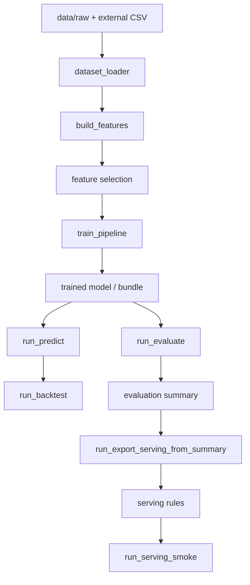

# システムアーキテクチャ

## 1. 全体像

`nr-learn` は、学習・評価・予測・backtest・serving validation を分断せずに扱う構成を取っている。

現在の基本フローは次のとおりである。

## 2. レイヤ構成

### 2.1 Common Layer

主なファイル:

- [src/racing_ml/common/config.py](../src/racing_ml/common/config.py)
- [src/racing_ml/common/artifacts.py](../src/racing_ml/common/artifacts.py)
- [src/racing_ml/common/probability.py](../src/racing_ml/common/probability.py)
- [src/racing_ml/common/progress.py](../src/racing_ml/common/progress.py)
- [src/racing_ml/common/regime.py](../src/racing_ml/common/regime.py)

役割:

- YAML 設定の読込
- model / report / manifest の保存先解決
- 長時間処理の進捗表示
- date window に応じた regime override 解決

`regime.py` は現在の設計で重要な基盤であり、evaluation と serving の両方で date window に応じたルール切替を支えている。

### 2.2 Data Layer

主なファイル:

- [src/racing_ml/data/dataset_loader.py](../src/racing_ml/data/dataset_loader.py)
- [src/racing_ml/data/ingest.py](../src/racing_ml/data/ingest.py)
- [src/racing_ml/data/netkeiba_crawler.py](../src/racing_ml/data/netkeiba_crawler.py)
- [src/racing_ml/data/netkeiba_backfill.py](../src/racing_ml/data/netkeiba_backfill.py)
- [src/racing_ml/data/netkeiba_id_prep.py](../src/racing_ml/data/netkeiba_id_prep.py)
- [src/racing_ml/data/netkeiba_race_list.py](../src/racing_ml/data/netkeiba_race_list.py)

役割:

- JRA 主表の読込
- `append_tables` と `supplemental_tables` による外部データ統合
- netkeiba 由来データの ID 準備、収集、backfill

現在の data layer は、「主表を壊さず、追加ソースを config で足す」設計になっている。

### 2.3 Feature Layer

主なファイル:

- [src/racing_ml/features/builder.py](../src/racing_ml/features/builder.py)
- [src/racing_ml/features/selection.py](../src/racing_ml/features/selection.py)

役割:

- レース前に利用可能な特徴量の生成
- `all_safe` / `explicit` による特徴量選択
- categorical columns の確定
- coverage の要約

特徴量の中心は次の 4 系統である。

- 履歴成績
- 位置取り・ペース
- time 正規化
- recent domain 系の補助特徴

### 2.4 Model Layer

主なファイル:

- [src/racing_ml/models/trainer.py](../src/racing_ml/models/trainer.py)
- [src/racing_ml/models/value_blend.py](../src/racing_ml/models/value_blend.py)

役割:

- LightGBM / CatBoost の学習
- train / valid split に基づく評価
- 単体モデルや `value_blend_model` bundle の構築

現在の中核は、CatBoost の勝率推定を土台にしつつ、必要に応じて ROI 系モデルを組み合わせる構成である。

### 2.5 Pipeline Layer

主なファイル:

- [src/racing_ml/pipeline/train_pipeline.py](../src/racing_ml/pipeline/train_pipeline.py)
- [src/racing_ml/pipeline/backtest_pipeline.py](../src/racing_ml/pipeline/backtest_pipeline.py)
- [src/racing_ml/pipeline/bundle_pipeline.py](../src/racing_ml/pipeline/bundle_pipeline.py)

役割:

- 学習手順の標準化
- backtest 実行
- bundle manifest の生成

### 2.6 Serving Layer

主なファイル:

- [src/racing_ml/serving/predict_batch.py](../src/racing_ml/serving/predict_batch.py)
- [src/racing_ml/serving/runtime_policy.py](../src/racing_ml/serving/runtime_policy.py)

役割:

- target date の予測実行
- score source の切替
- runtime policy の解決と annotation

`predict_batch.py` は `serving.score_regime_overrides` と `serving.policy_regime_overrides` を解釈し、日付ごとに予測スコア系統と購入ルールを切り替える。

## 3. 実行スクリプトの役割

### 3.1 基本フロー

- [scripts/run_ingest.py](../scripts/run_ingest.py)
  - データ取得と初期整備
- [scripts/run_train.py](../scripts/run_train.py)
  - モデル学習と artifact 出力
- [scripts/run_evaluate.py](../scripts/run_evaluate.py)
  - 指標計算、nested walk-forward、policy search
- [scripts/run_predict.py](../scripts/run_predict.py)
  - 指定日予測
- [scripts/run_backtest.py](../scripts/run_backtest.py)
  - 予測結果に基づく backtest

### 3.2 stack / artifact 系

- [scripts/run_build_value_stack.py](../scripts/run_build_value_stack.py)
- [scripts/run_bundle_models.py](../scripts/run_bundle_models.py)

これらは学習済み component をまとめて、再利用しやすい形にするための入口である。

### 3.3 serving 検証系

- [scripts/run_export_serving_from_summary.py](../scripts/run_export_serving_from_summary.py)
- [scripts/run_serving_smoke.py](../scripts/run_serving_smoke.py)
- [scripts/run_serving_smoke_compare.py](../scripts/run_serving_smoke_compare.py)

この 3 本で、evaluation summary から serving rule を作り、実日付で挙動を検証し、候補同士を比較する。

### 3.4 外部データ運用系

- [scripts/run_prepare_netkeiba_ids.py](../scripts/run_prepare_netkeiba_ids.py)
- [scripts/run_collect_netkeiba.py](../scripts/run_collect_netkeiba.py)
- [scripts/run_backfill_netkeiba.py](../scripts/run_backfill_netkeiba.py)
- [scripts/run_validate_data_sources.py](../scripts/run_validate_data_sources.py)
- [scripts/run_feature_gap_report.py](../scripts/run_feature_gap_report.py)
- [scripts/run_netkeiba_coverage_snapshot.py](../scripts/run_netkeiba_coverage_snapshot.py)
- [scripts/run_netkeiba_benchmark_gate.py](../scripts/run_netkeiba_benchmark_gate.py)

これらは外部データの投入と品質確認を担当する。

## 4. Artifact 構造

このプロジェクトでは、結果をあとから追跡できるように artifact を重視している。

主な出力先:

- `artifacts/models/`
  - 学習済みモデルや bundle
- `artifacts/reports/`
  - train/evaluate/backtest/serving の JSON や CSV
- `artifacts/predictions/`
  - 日付単位の予測結果

学習時には、モデル本体だけでなく report と manifest も揃えて保存する。

## 5. 現在の設計上の要点

### 5.1 評価と運用を切り離さない

`run_evaluate.py` では raw 指標だけでなく、policy search を含む nested walk-forward まで扱う。
その結果を `run_export_serving_from_summary.py` と `run_serving_smoke.py` で運用確認へつなげる設計になっている。

### 5.2 regime を共通基盤で扱う

regime 切替は ad hoc な if 文ではなく、`common/regime.py` を通して日付窓から解決する。
このため、evaluation と serving で同じ考え方を共有できる。

### 5.3 外部データは config 駆動で足す

外部ソースは loader を毎回書き換えるのではなく、`configs/data.yaml` の設定で足す方針を取る。
これにより、データ拡張と学習ロジックの結合を弱くしている。

## 6. この文書の読み方

- 何を良い結果とみなすかは [benchmarks.md](benchmarks.md) を参照する。
- 外部データの扱いは [data_extension.md](data_extension.md) を参照する。
- 現在の到達点は [project_overview.md](project_overview.md) を参照する。